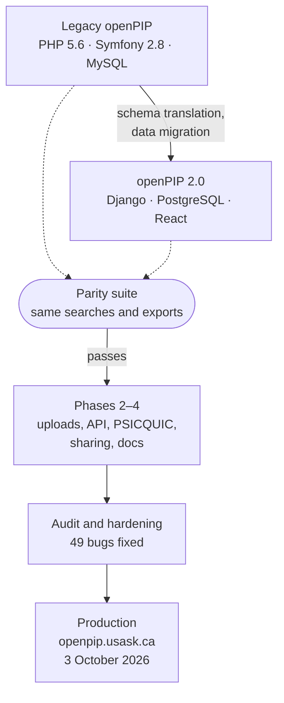
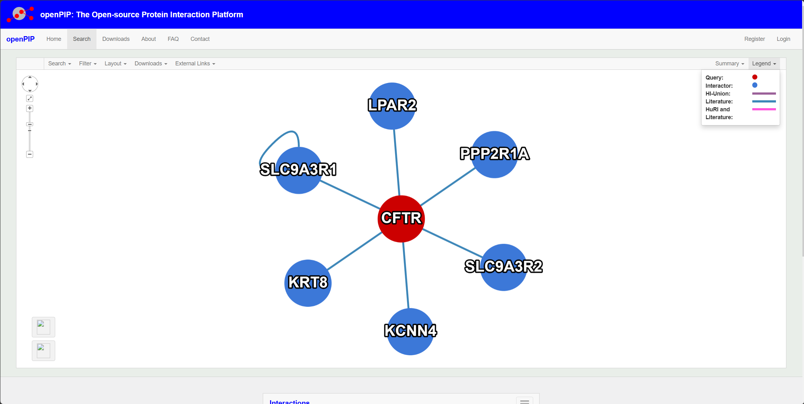
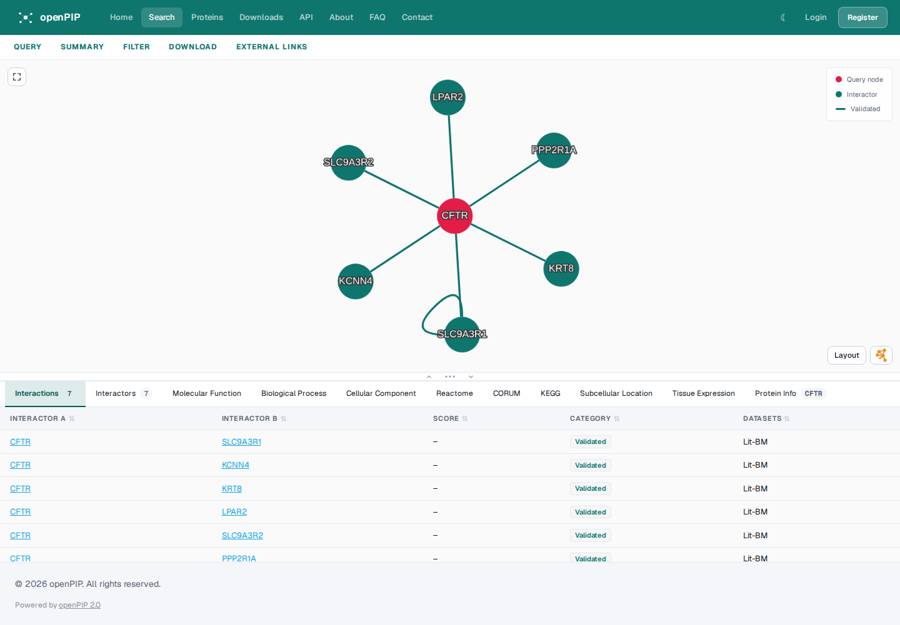

# openPIP 2.0: GSoC 2026 Final Report

**Contributor:** Mahafujul Hamid Ananda

**Organization:** National Resource for Network Biology (NRNB)

**Mentors:** Dr. Mohamed Helmy (VIDO), Dr. Gary Bader (University of Toronto)

**Repository:** <https://github.com/Helmy-Lab/openpip-2.0>

**Live portal:** <https://openpip.usask.ca>

**Documentation:** <https://openpip.usask.ca/docs/>

<!-- more -->

## Project goals

[openPIP](https://github.com/BaderLab/openPIP) (Helmy et al., *J. Mol. Biol.*
2022) is the platform that hosts the Human Reference Interactome (HuRI) portal.
Research groups use it to publish protein–protein interaction data: readers
search for proteins, explore interaction networks and download datasets. The
original runs on PHP 5.6, Symfony 2.8 and MySQL, all now past end of life, and
the paper itself names a missing API as a gap.

The project set out to:

1. **Rebuild openPIP on a maintained stack** (Django 5 + Django REST Framework,
   PostgreSQL 16, React 19 + TypeScript + Vite), keeping every legacy feature
   working the same way. The schema is a 1:1 translation of the legacy one.
2. **Prove parity** with automated tests that run the same searches and exports
   against the legacy site and the new one, and compare the results.
3. **Then add what was planned beyond parity:** CSV uploads, background imports
   with progress, UniProt enrichment, programmatic access (REST API and
   PSICQUIC), and a deployment that other groups can run.

## What I did

The work ran in four phases: parity with legacy openPIP, the planned
enhancements, performance and mentor feedback, then programmatic access,
sharing and documentation. The
[commit history](https://github.com/Helmy-Lab/openpip-2.0/commits/main/) and
[full diff](https://github.com/Helmy-Lab/openpip-2.0/compare/6fcf2a4...main)
show everything, and `CHANGELOG.md` lists each user-visible change.

### Phase 1: parity with legacy openPIP (May)

- Translated the legacy MySQL schema to PostgreSQL as Django models, and wrote
  a data migration script (`migration/migrate_legacy.py`).
- Rebuilt every legacy user flow: multi-identifier search, the interactive
  Cytoscape.js network with confidence, evidence, tissue and annotation filters,
  protein and interaction details with external links, term enrichment
  (g:Profiler), tissue expression and subcellular location, network and dataset
  downloads, accounts, and the admin settings.
- Wrote a parity suite (`backend/tests/parity/`, 40 tests over search, catalog
  and exports) that queries the legacy portal and the 2.0 API and compares
  proteins, interactions, scores and output files. On 3 October 2026 it passed
  79 checks against the legacy site at its new address.

The same search (CFTR) on the legacy site and on openPIP 2.0 returns the same
six interactors, shown in the new interface.

*Before: legacy openPIP.*

*After: openPIP 2.0, with the interaction table and enrichment tabs below the network.*

### Phase 2: planned enhancements (May)

- CSV and PSI-MI TAB uploads, with a preview, run as background imports
  (Celery + Redis) with a progress view.
- Automatic enrichment of new proteins from UniProt and Ensembl, and of new
  organisms from NCBI Taxonomy.
- The full admin panel: data, file and announcement managers.
- Production setup: Gunicorn, production settings, a Docker Compose override.

### Phase 3: performance and mentor feedback (May to August)

- Rewrote the search queries and added database indexes. Tests keep each
  search path at 15 queries or fewer.
- A 3D structure viewer for proteins (AlphaFold model with confidence, or a
  PDB structure).
- Worked through a 17-item batch of mentor feedback: gene autocomplete,
  enrichment prefetching, cited data sources on every tab, free downloads
  without signing in, an admin layout, editable home-page content, and the FAQ.
- A citation and About-page entry for every dataset, editable by admins and
  looked up by PubMed ID or DOI.

### Phase 4: programmatic access, sharing and documentation (May to October)

- A JSON REST API with an OpenAPI schema and Swagger UI.
- A [PSICQUIC](https://psicquic.github.io/) service: PSI-MI TAB 2.5 to 2.8,
  MIQL with boolean operators, ROGID/RIGID checksums, rate limits.
- Saved networks, saved views that re-run on current data, sharing with notes,
  discussion threads, notifications, and public links.
- User profiles, and account recovery through security questions (by decision,
  openPIP sends no email).
- A site-text registry, so admins can change every piece of interface text
  without code.
- A documentation site served at `/docs/` on every portal, with user, admin and
  operator guides and an API reference that tests keep in step with the code.

### Hardening and deployment (September to October)

- A full-project audit and a documentation review turned up bugs that are
  tracked in `docs/BUGS.md`. All 49 entries there are fixed. They included a default secret key in production,
  stored XSS through avatar uploads, a media path traversal, and an empty search
  that returned the whole database.
- A whole deployment is configured by one setting, `PUBLIC_URL`, so another
  group can run its own portal from a fresh clone.
- Moved the repository to the lab organization (Helmy-Lab) and merged the final
  work through PRs [#1](https://github.com/Helmy-Lab/openpip-2.0/pull/1) and
  [#2](https://github.com/Helmy-Lab/openpip-2.0/pull/2).
- **openPIP 2.0 replaced the legacy site at <https://openpip.usask.ca> on
  3 October 2026.** The legacy PHP site remains at `/legacy/` for comparison.

### By the numbers

| | |
|---|---|
| Commits | 222 |
| Application code (backend + frontend) | ~53,000 lines added |
| Documentation | ~6,700 lines |
| Backend tests | 570 (pytest), including 40 parity tests |
| Frontend tests | 523 (Vitest) |

## Current state

openPIP 2.0 is in production at <https://openpip.usask.ca>, serving the Human
Reference Interactome data. Every legacy feature works, and the parity suite
passes against the legacy site. Everything is merged to `main` in
[Helmy-Lab/openpip-2.0](https://github.com/Helmy-Lab/openpip-2.0). No version
has been tagged yet. The work is heading towards 2.0.0.

## What's left

- **Tag 2.0.0** and publish the release.
- **Dataset citations:** 7 of 9 datasets still need their citation entered
  through the admin panel.
- **Duplicate protein stubs (BUG-034):** earlier uploads created about 8,200
  empty duplicates, and HuRI is attached to them. New uploads no longer create
  them. The existing data is deliberately left unmerged for now.
- **PSICQUIC registry listing:** an enquiry to the EBI maintainers is drafted
  (`docs/project/psicquic-registry-enquiry.md`). It asks whether a REST-only
  service can be listed, or whether a SOAP endpoint is needed first.
- **A Python SDK and CLI** (`openpip` on PyPI) was planned but not built. The
  REST API, OpenAPI schema and PSICQUIC already give programs full access.
- **Open decisions** for the lab: container registry, Gunicorn or an ASGI
  server, Zenodo for dataset files.

Anyone picking this up should start with the
[operator guide](https://openpip.usask.ca/docs/operator-guide/installation/),
[CONTRIBUTING.md](https://github.com/Helmy-Lab/openpip-2.0/blob/main/CONTRIBUTING.md), and [MIGRATION_STRATEGY.md](https://github.com/Helmy-Lab/openpip-2.0/blob/main/docs/project/MIGRATION_STRATEGY.md).

## Upstream status

openPIP 2.0 is a rebuild, not a patch to the original
[BaderLab/openPIP](https://github.com/BaderLab/openPIP) code, so it lives in
its own repository under the lab's organization rather than being merged into
the original. All of the work is merged to `main` there.

## Challenges and what I learned

**The biggest challenge was keeping parity with the original openPIP while
making it faster.** Every search, upload and export had to give the same
results as the legacy site. At the same time, I was rewriting the search
queries and adding indexes to bring each search down to 15 database queries or
fewer. Any speed-up that changed a result counted as a regression, so the parity
tests against the live legacy site were the check on every optimization.

**I learned about testing and validation.** By the end there were over a
thousand tests across the backend and frontend. The parity suite showed me
that a test can check a whole system against another live system, not just a
single function. The audit at the end found real security bugs that the
feature tests had missed. That taught me to validate the whole system, not
only the code I had just written.

**I learned about system design.** openPIP 2.0 is made up of several parts
that work together: the API, the database, a background worker for imports,
the frontend, the documentation site and a reverse proxy. Running it in
production taught me how those parts depend on each other, and why the whole
deployment should be configured from one place (`PUBLIC_URL`).

## Acknowledgements

Thank you to Dr. Mohamed Helmy and Dr. Gary Bader for their guidance and
feedback throughout the summer, to NRNB for hosting the project, and to Google
Summer of Code.
